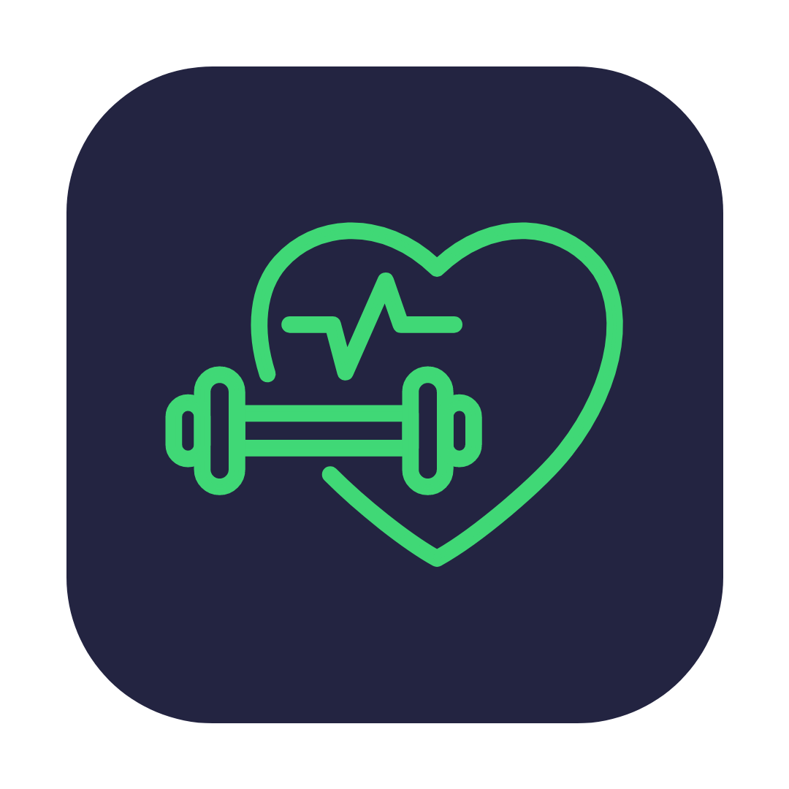
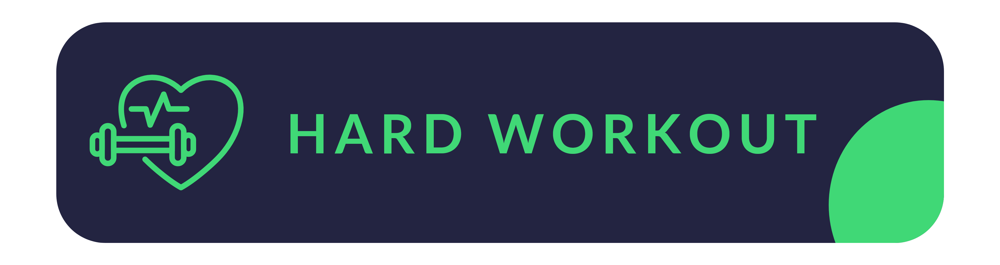

# Work Out

## Overview
It's a mobile application for both android and ios made for work out and fitness purpose with many features you can read about here, but it can be used under all subject you want, well architected code and organized !

## Development Features 

- Firebase integration ( Login, Sign Up, Connecting with database, Exchange of data from database to users, Connecting with cloud storage....)
- Made by flutter so it can work on both ios/android with possibility to make it work on windows, web.. 
- Developed with MVC (Model - View - Controller) Architecture, so it gives you more freedom and organization for folders, assets, files... 
- Well commented and organized
- Easy change to colors (from AppColors class) 
- All texts that has nothing with app data cn be modified from one file( AppTexts class ) 
- Divising app by components so it can be reusable
- In app local data with pre-processing it for user experience( so it's no need to load from server, because the idea here that there no need to globally load to data, you ca manage it however you want by making a new Model for anything you need to move and linking it to the app ) 

## App features

- Clean UI design
- 60-30-10 color theory
- fade in show animations
- Native splash screen
- Covering most necessary pages for user ( Login, Sign Up, Email Verification, Forgetting Password( Reset Password ),  Possibility to delete the account, Possibility to change personal information)
- The app will remember user sign in even the app is restarted, until you sign out

## Note
The app is not completed and the goal of it is to not complete it,it's open source project, feel free to use it as it's yours, but it still need work like integrating contents like videos, images, work outs information(descriptions, reviews... ), payements methods, 
Free trials, google sign in, facebook sign in ......., by this project, you will not start from point 0. 

## Usage
After cloning project files, open it in your editor

Run
#### flutter pub get

link it with your firebase account with flutterfire and configure it
Check <a href="https://firebase.flutter.dev/docs/overview">flutterfire here</a>

# Issues? 
If you faced any problems with using it, please feel free to open an issues request <a href="https://github.com/anasfik/work-out-mobile-app/issues">from here</a>, I will be happy to work on it

# Contribute 
There are more sections you czn help this project to grow( if you want to), by adding more features, translating contents, correcting mistakes..., fork it, or clone it using git and make a new branch, make your changes and push it, I 'll be happy to add it to the main project
